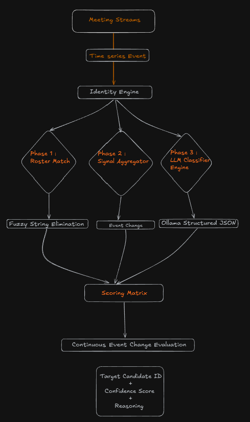

# Sherlock Real-Time Candidate Identification Engine

An intelligent, multi-weak-signal pipeline built to identify the correct interview candidate during messy live meetings in real time. This prototype functions as the routing layer for Sherlock's downstream fraud detection modules (deepfake detection, voice cloning, behavioral analysis), ensuring compute resources are locked onto the correct participant stream.

## Project Overview & Aim

In production environments, identifying a candidate by simple display name text matching fails due to several real-world anomalies:
* Candidates joining with default device configurations (e.g., `"MacBook Pro"`, `"Aum's iPad"`).
* Network drops resulting in a re-connection under a completely anonymous participant session ID.
* Interviewers entering with typos or overlapping names.

This engine ingests continuous streaming telemetry (audio pulses, webcam state, and real-time transcript chunks) and combines them with static external ATS/Calendar metadata to continuously update an identity verification matrix with an associated confidence score and explicit system explainability.

---

## System Architecture

The pipeline implements a decoupled Event-Driven Streaming Architecture. The processing logic is completely sandboxed from future event context, evaluating state adjustments chronologically exactly like a live WebRTC or Webhook client connection.

